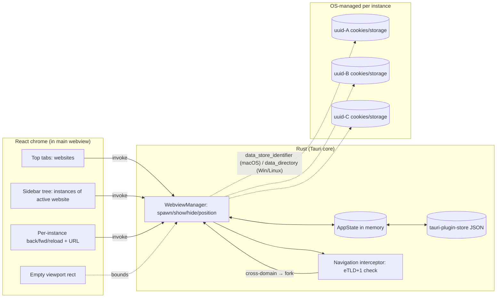

# feat: Multi-session browser app (Rust + Tauri 2)

A lightweight cross-platform desktop app for running many session-isolated webviews of the same website (e.g. five Google accounts side by side). System webview, no Chromium bundle. Cross-domain link clicks fork into child sub-instances rendered as a tree under their parent.

---

## Summary

Build a Rust + Tauri 2.x desktop app with a React chrome and one platform-native webview per logged-in session. The window has a top tab bar of websites and a left sidebar of instances scoped to the active website; each instance is a session-isolated webview backed by a platform-specific cookie/data store, addressed by a stable UUID. The user adds/renames/removes instances and websites; state persists across restarts. Cross-domain navigation is intercepted and forked into a child instance rendered as a sub-node in the sidebar tree (auto-fork — no prompt).

---

## Problem Frame

Chrome profiles and tools like Wavebox solve multi-account isolation by either bundling a full Chromium or running it through Electron, costing 200MB+ per app and hundreds of MB of RAM per logged-in service. The goal is the same isolation with a system-webview footprint (5–15MB binary, OS-cached web engine). The app's mental model is deliberately not "profiles span websites" — it is "every instance belongs to exactly one website," matching how multi-account workflows actually look in practice.

---

## Key Technical Decisions

- **Tauri 2.x with `unstable` feature gate for multi-webview-per-window.** Use `tauri::window::Window::add_child(WebviewBuilder, position, size)` to mount many webviews in one parent window. The `unstable` feature is required and patch-version breaks are explicitly allowed by the Tauri team; pin exact versions in Cargo.toml. ([docs](https://docs.rs/tauri/latest/tauri/window/struct.Window.html), [tracking issue #10079](https://github.com/tauri-apps/tauri/issues/10079))
- **Per-instance UUID drives per-platform isolation key.** One `uuid::Uuid` per instance, then:
  - macOS → `WebviewBuilder::data_store_identifier(uuid.into_bytes())` mapping to `WKWebsiteDataStore(forIdentifier:)`. Requires **macOS 14+** as a hard floor.
  - Windows → `WebviewBuilder::data_directory($APP_DATA/webviews/<uuid>/)` (WebView2 user data folder).
  - Linux → `WebviewBuilder::data_directory($APP_DATA/webviews/<uuid>/)` (WebKitGTK WebsiteDataManager).
  This is the supported answer — the umbrella isolation request was closed as not-planned; platform-native builder methods are the canonical path. ([wry#1198](https://github.com/tauri-apps/wry/discussions/1198), [tauri#11491](https://github.com/tauri-apps/tauri/issues/11491))
- **Auto-fork cross-domain navigation via eTLD+1 check.** Use the `psl` crate to compute eTLD+1 from each navigation target. Same eTLD+1 as the instance's parent website → allow. Different → cancel and spawn a child instance pinned to the new domain, attached under the parent in the tree. Same logic in `on_new_window` for `target=_blank` / `window.open`. eTLD+1 (not host) is correct so `accounts.google.com` ↔ `mail.google.com` stays in one instance during SSO.
- **Frontend chrome: React + Vite + TypeScript.** User-confirmed. Sidebar tree, top tab bar, and instance chrome bar are React; the webview area is a positioned rect that Rust draws platform-native webviews into. No webview wrappers — the React layer never sees the webview content, only its bounds.
- **Persistence: `tauri-plugin-store` at `$APP_DATA/metadata/store.json`.** Data is small (instance UUIDs, names, parent links, URLs), writes are infrequent, and the plugin is officially maintained. Sibling directories keep metadata and OS-managed cookie/storage state easy to back up or wipe together.
- **Single-instance app via `tauri-plugin-single-instance`.** Required because WebView2 fails noisily if two app instances contend on the same user-data-folder; a second launch should focus the running app, not start a second process.
- **Lazy webview spawn.** On startup, only spawn the active website's active instance. Other instances are spawned on first activation. Avoids paying webview init cost for every instance the user has ever created.

---

## High-Level Technical Design



**Data model (directional):**

```text
AppState
├─ websites: Vec<Website>
│   └─ Website { id, url_root, display_title, instance_ids: Vec<Uuid>, active_instance: Option<Uuid> }
└─ instances: HashMap<Uuid, Instance>
    └─ Instance {
         id: Uuid,
         website_id,
         parent_instance_id: Option<Uuid>,  // None for root instances; Some for cross-domain forks
         user_name: Option<String>,         // explicit rename; None means show page title
         page_title: Option<String>,        // synced from webview
         current_url: String,
         created_at,
       }
```

Sidebar tree is projected by grouping `instances` where `website_id == active_website` and walking `parent_instance_id` pointers. Tree is presentation; storage is flat.

---

## Output Structure

```text
Multi-app/
├─ Cargo.toml
├─ package.json
├─ vite.config.ts
├─ tsconfig.json
├─ src/                              # React frontend
│  ├─ main.tsx
│  ├─ App.tsx
│  ├─ components/
│  │  ├─ TopTabs.tsx
│  │  ├─ Sidebar.tsx
│  │  ├─ SidebarNode.tsx
│  │  ├─ ChromeBar.tsx
│  │  └─ Viewport.tsx
│  ├─ ipc/
│  │  └─ commands.ts                 # typed wrappers around invoke()
│  ├─ state/
│  │  └─ store.ts                    # Zustand or useReducer; small
│  └─ types.ts
├─ src-tauri/
│  ├─ Cargo.toml
│  ├─ tauri.conf.json
│  ├─ capabilities/
│  │  └─ default.json
│  ├─ build.rs
│  └─ src/
│     ├─ main.rs                     # tauri::Builder, plugins, setup
│     ├─ model.rs                    # AppState, Website, Instance
│     ├─ store.rs                    # tauri-plugin-store hydration + persist
│     ├─ webview_manager.rs          # spawn/show/hide/position child webviews
│     ├─ nav_guard.rs                # eTLD+1 check, fork decision
│     ├─ commands.rs                 # #[tauri::command] handlers
│     └─ paths.rs                    # $APP_DATA layout helpers
└─ docs/plans/2026-06-23-001-feat-multi-session-browser-plan.md
```

On disk at runtime:

```text
$APP_DATA/com.user.multiapp/
├─ metadata/
│  └─ store.json
└─ webviews/
   ├─ <uuid-A>/                      # Windows + Linux only
   └─ <uuid-B>/
# macOS: WebKit stores live under ~/Library/WebKit/WebsiteDataStore/<uuid>/
```

---

## Scope Boundaries

**In scope (v1):**

- Add / remove / rename instances from the sidebar
- Add / remove websites (top tabs)
- Per-instance back / forward / reload
- Per-instance session isolation across macOS 14+ / Windows 10+ / Linux (WebKitGTK 2.40+)
- Auto-fork on cross-domain navigation, rendered as a child node in the sidebar tree
- Persist websites, instance tree, names, last-active across restarts

**Deferred to Follow-Up Work:**

- Bookmarks / history beyond what the OS webview persists implicitly
- Browser extensions
- Sync across machines (cloud)
- Themes / appearance customization
- Keyboard shortcuts for instance/tab switching (worth doing after v1 settles)
- Per-instance icon/color/avatar in the sidebar
- Auto-updater (Tauri supports it; not v1)
- Mobile (iOS/Android via Tauri 2 mobile)

**Outside this product's identity:**

- Not a general-purpose browser. Each instance is anchored to a website; the chrome doesn't aspire to URL-bar-as-search.
- Not a fork of Chromium / WebKit / Gecko.

---

## Implementation Units

### U1. Project scaffold + cross-platform Tauri 2 baseline

**Goal:** A buildable Tauri 2.x app with a React + Vite + TS frontend, all three platforms producing a window that opens to a placeholder UI. Set the platform floors and the `unstable` feature gate that later units depend on.

**Requirements advanced:** scaffolding for everything below.

**Dependencies:** none.

**Files (create):**

- `Cargo.toml` (workspace root if needed)
- `package.json`, `vite.config.ts`, `tsconfig.json`, `index.html`
- `src/main.tsx`, `src/App.tsx` (placeholder rendering "Multi-app")
- `src-tauri/Cargo.toml` — `tauri = { version = "=2.x.y", features = ["unstable"] }`, pin exact, do not use `^`. Also `tauri-plugin-store`, `tauri-plugin-single-instance`, `serde`, `uuid` (`v4`), `psl`, `url`, `anyhow`, `tracing`.
- `src-tauri/tauri.conf.json` — `bundle.targets` for `app`/`dmg`/`msi`/`appimage`/`deb`; `bundle.macOS.minimumSystemVersion = "14.0"`; `productName`, `identifier = "com.user.multiapp"`.
- `src-tauri/capabilities/default.json` — `core:default`, `core:webview:allow-create-webview`, `core:webview:allow-set-webview-position`, `core:webview:allow-set-webview-size`, `core:webview:allow-show-webview`, `core:webview:allow-hide-webview`, `core:webview:allow-reparent`. Use a wildcard webview label pattern so dynamically labelled child webviews are covered.
- `src-tauri/src/main.rs` — `tauri::Builder::default().plugin(tauri_plugin_store::Builder::default().build()).plugin(tauri_plugin_single_instance::init(...))...`.
- `src-tauri/src/paths.rs` — helpers returning `$APP_DATA/metadata/` and `$APP_DATA/webviews/`, creating dirs on first run.

**Approach:** Use `cargo create-tauri-app` with the React-TS template, then add the dependencies above. Strip starter boilerplate that conflicts with the planned IPC surface.

**Patterns to follow:** Tauri 2 React-TS starter; capability files live under `src-tauri/capabilities/`. See [Tauri 2 React/Vite scaffolding guide](https://v2.tauri.app/start/create-project/).

**Test scenarios:**

- `cargo check` succeeds on macOS 14, Windows 11, Linux (WebKitGTK 2.40+).
- `npm run tauri dev` opens a window showing the placeholder React UI on each OS.
- Plugin init does not panic; `$APP_DATA/com.user.multiapp/{metadata,webviews}/` directories exist after first launch.
- Test expectation: no Rust unit tests in this unit — wiring/configuration only. Smoke verification per OS is the test.

**Verification:** Single-instance lock works (launching twice focuses the existing window). No console errors. The `unstable` feature is active (a `Window::add_child` reference compiles).

---

### U2. Core data model and store schema

**Goal:** Rust types for `Website` and `Instance`, an `AppState` aggregate, serde derives, schema version, and load/save through `tauri-plugin-store`.

**Requirements advanced:** persistence across restarts.

**Dependencies:** U1.

**Files (create):**

- `src-tauri/src/model.rs` — `Website`, `Instance`, `AppState`, `StoreSchema { version: u32, app: AppState }`.
- `src-tauri/src/store.rs` — `load(app: &AppHandle) -> AppState`, `persist(app: &AppHandle, state: &AppState) -> Result<()>` with 250ms debounce via a `tokio::sync::Notify` + spawned task. Atomic write semantics handled by the store plugin.
- `src-tauri/tests/model_tests.rs`

**Approach:** Flat storage with parent pointers — `instances` is a `HashMap<Uuid, Instance>`, each carries `parent_instance_id: Option<Uuid>`. Tree projection lives in the frontend's selector layer. On every mutation, set a dirty flag; debounced background task writes JSON.

**Patterns to follow:** standard `serde` + `serde_json` round-trip; explicit `version: 1` at the top of the store schema so future migrations have an anchor.

**Test scenarios:**

- Round-trip: `AppState::default()` → serialize → deserialize → equal.
- Round-trip: a state with three websites and a tree of five instances (one root + two children + one grandchild + one sibling) → serialize → deserialize → equal, with parent pointers preserved.
- Schema-version test: a JSON blob with `version: 1` loads cleanly; a blob with `version: 99` returns an explicit `IncompatibleVersion` error rather than partial state.
- Tree projection helper: given the five-instance state above, projecting the tree for a specific `website_id` returns the expected nested shape with correct child order.
- Debounced persist: ten rapid mutations result in at most two disk writes within 500ms (load-bearing for not thrashing the store).

**Verification:** All unit tests pass on each OS. `store.json` after a manual mutation matches the in-memory state on reload.

---

### U3. WebviewManager — spawn + position + isolation

**Goal:** A Rust module that owns the lifecycle of child webviews. Spawning one webview per instance UUID with platform-correct session isolation. Manages which webview is currently visible and where it sits in the window.

**Requirements advanced:** session isolation (the core technical risk).

**Dependencies:** U1, U2.

**Files (create):**

- `src-tauri/src/webview_manager.rs` — `WebviewManager { active: Option<Uuid>, spawned: HashMap<Uuid, WebviewHandle>, viewport: Rect }`. Methods: `ensure_spawned(&self, instance) -> Result<&Webview>`, `activate(&mut self, instance_id)`, `set_viewport(&mut self, rect)`, `destroy(&mut self, instance_id)`.
- `src-tauri/src/webview_manager/isolation.rs` — platform-conditional helper `fn apply_isolation(builder: WebviewBuilder, uuid: Uuid) -> WebviewBuilder`:
  - `#[cfg(target_os = "macos")]` → `builder.data_store_identifier(*uuid.as_bytes())`
  - `#[cfg(any(target_os = "windows", target_os = "linux"))]` → `builder.data_directory(webviews_dir().join(uuid.to_string()))`

**Approach:** All child webviews are attached to the single main `Window`. Inactive ones are hidden via `Webview::hide()`; active one is shown and positioned to the current viewport `Rect`. On window resize, the React layer reports the new viewport rect via IPC and the manager re-positions the visible webview. Each webview's `WebContext` is kept alive for its lifetime (Wry's macOS custom-protocol gotcha).

**Patterns to follow:** Tauri's [WebviewBuilder docs](https://docs.rs/tauri/latest/tauri/webview/struct.WebviewBuilder.html); platform conditional compilation per the data-store research.

**Test scenarios:**

- Unit: `apply_isolation` on macOS returns a builder whose configured data store identifier equals the UUID bytes (mock the builder if needed; otherwise compile-only test).
- Unit: `apply_isolation` on Windows/Linux returns a builder whose `data_directory` matches `webviews_dir().join(uuid.to_string())`.
- Integration (manual smoke per OS): spawn two webviews on `https://example.com`, set a different `document.cookie` in each, reload both, verify cookies are independent.
- Integration (manual smoke per OS): activate UUID-A, then UUID-B — only one webview is visible at a time, and the active one fills the reported viewport rect.
- Integration (manual smoke per OS): resize the window — the active webview re-positions to the new viewport rect.
- Edge case: `ensure_spawned` called twice for the same UUID returns the existing webview, does not double-spawn.

**Verification:** On each OS, two simultaneously open Google logins do not share cookies. (This is the load-bearing acceptance test for the whole project.)

---

### U4. IPC commands surface

**Goal:** The full set of `#[tauri::command]` handlers the React layer needs.

**Requirements advanced:** add/remove/rename instances and websites; per-instance navigation controls.

**Dependencies:** U2, U3.

**Files (create):**

- `src-tauri/src/commands.rs` — commands listed below.
- `src/ipc/commands.ts` — typed wrappers using `@tauri-apps/api/core::invoke`.
- `src/types.ts` — DTOs matching the Rust serde shapes.

**Commands:**

- `list_websites() -> Vec<WebsiteDto>`
- `add_website(url: String) -> WebsiteDto`
- `remove_website(id: String)` — removes website, removes all its instances, deletes their `webviews/<uuid>/` dirs.
- `list_instance_tree(website_id: String) -> Vec<InstanceTreeNode>`
- `add_instance(website_id: String, name: Option<String>) -> InstanceDto`
- `rename_instance(id: String, name: String)`
- `remove_instance(id: String)` — removes instance and all descendants; deletes their `webviews/<uuid>/` dirs.
- `activate_website(id: String)`
- `activate_instance(id: String)` — ensures spawn, shows.
- `set_viewport_bounds(rect: ViewportRect)` — called by the React layer when its placeholder div resizes.
- `instance_back(id: String)`, `instance_forward(id: String)`, `instance_reload(id: String)`
- `navigate_instance(id: String, url: String)` — same-domain only enforced by U5; if cross-domain, returns the new child instance ID after fork.

**Events emitted to frontend:**

- `instance:added` (when a fork creates a new instance), `instance:url_changed`, `instance:title_changed`, `instance:removed`.

**Approach:** All commands take `tauri::State<AppStateLock>` (a `Mutex<AppState>` or `RwLock`) plus `AppHandle`. Mutations call `store::persist(...)` to schedule a debounced save.

**Test scenarios:**

- Each command: happy path round-trip from React via `invoke()` returns the expected DTO and updates persisted store.
- `remove_website` cascades: removing a website with 3 instances and 2 grandchild forks results in 5 instances removed and 5 `webviews/<uuid>/` dirs deleted (Windows/Linux), or 5 WKWebsiteDataStore entries removed (macOS via `removeData`).
- `rename_instance` to empty string returns an explicit `EmptyName` error rather than persisting an empty name.
- `add_instance` for a website that has zero instances creates the new instance as a root (no parent_instance_id).
- `add_instance` issued while a fork event is in flight does not race — both end up in the store with distinct UUIDs.
- Events: forking emits exactly one `instance:added` event with the new instance's full DTO including `parent_instance_id`.

**Verification:** All `cargo test` and React component tests for the IPC layer pass. Manual smoke: add/rename/remove flows visibly update both the sidebar and the persisted JSON.

---

### U5. Cross-domain navigation interception (auto-fork)

**Goal:** Every webview's navigation events run through an interceptor. Same-eTLD+1 → allow. Different → cancel, spawn a child instance under the navigating instance, attach to the sidebar tree.

**Requirements advanced:** cross-domain forking with parent → child tree relationship.

**Dependencies:** U2, U3, U4.

**Files (create):**

- `src-tauri/src/nav_guard.rs` — `fn registered_domain(url: &Url) -> Option<&str>` using `psl::domain_str`; `fn is_same_site(current_root: &str, candidate: &Url) -> bool`.
- Wire-up in `src-tauri/src/webview_manager.rs` — `.on_navigation(...)` and `.on_new_window(...)` closures during webview construction.

**Approach:**

- The closure captures the instance's UUID and its "root domain" (eTLD+1 of the website root URL).
- `on_navigation(|url| -> bool)`:
  1. If `is_same_site(root, url)` → return `true` (allow).
  2. Else → enqueue a fork request `(parent_instance_id, target_url)` onto a channel; return `false` to cancel.
- A backend task consumes the channel, performs the fork (creates `Instance` with `parent_instance_id`, persists, calls `WebviewManager::ensure_spawned`, activates), and emits `instance:added`.
- `on_new_window(|url, _features| -> NewWindowResponse)`:
  - Always `Deny`. Enqueue the same fork request with `parent_instance_id` set, regardless of same-/cross-site (popups should always be their own instance per product spec — confirm during U5 implementation if same-site popups should instead reuse the parent).
- pushState / SPA route changes: NOT reliably caught by the navigation handler. v1 accepts this limitation — same-eTLD+1 SPAs (e.g., gmail.com client routing) don't need to fork anyway. Cross-domain SPA navigations are vanishingly rare; documented as a known limitation.

**Patterns to follow:** [Wry navigation handler docs](https://docs.rs/wry/latest/wry/struct.WebViewBuilder.html); `psl` crate's `domain_str` API.

**Test scenarios:**

- Unit: `is_same_site("google.com", url("https://mail.google.com/inbox"))` → `true`.
- Unit: `is_same_site("google.com", url("https://accounts.google.com/o/oauth2/v2/auth"))` → `true`.
- Unit: `is_same_site("google.com", url("https://docs.google.co.uk"))` → `false` (different eTLD+1, validates the PSL is in play).
- Unit: `is_same_site("co.uk", url("https://example.co.uk"))` → handled by `psl` correctly returning the registered domain, not the suffix.
- Unit: `is_same_site("github.com", url("https://github.io"))` → `false` (different registered domain).
- Integration (manual smoke per OS): in a `google.com` instance, click a link to `https://stripe.com` → original webview stays on `google.com`, a new child instance under that node appears in the sidebar with `stripe.com` loaded.
- Integration (manual smoke per OS): a Google login OAuth flow that bounces accounts.google.com → consent.google.com → back to gmail.com stays in one instance; no spurious forks.
- Integration (manual smoke per OS): a `target=_blank` popup is denied by Wry and surfaces as a fork.
- Edge case: a malformed URL passed to the interceptor does not panic; it falls back to "deny" with a logged warning.

**Verification:** Manual smoke matrix above passes on all three OSes. No spurious forks during a normal multi-step Google login.

---

### U6. React shell — top tabs, sidebar tree, viewport rect

**Goal:** The user-facing chrome. Top tab bar, recursive sidebar tree, inline rename, context menu for delete, and a `Viewport` component that reports its bounding rect to Rust whenever it changes so the active webview re-positions.

**Requirements advanced:** the UI side of every v1 requirement.

**Dependencies:** U4.

**Files (create):**

- `src/App.tsx` — top-level layout (top tabs row → main row split as sidebar + viewport).
- `src/components/TopTabs.tsx` — pills for each website, "+" button → modal/inline input to add a URL.
- `src/components/Sidebar.tsx` and `src/components/SidebarNode.tsx` — recursive node component; expand/collapse; right-click context menu (rename/delete); double-click to inline-rename.
- `src/components/ChromeBar.tsx` — back/forward/reload buttons + read-only URL display for the active instance.
- `src/components/Viewport.tsx` — empty `<div>` with a `ResizeObserver` that calls `set_viewport_bounds` via IPC; also reports on window resize and on initial mount.
- `src/state/store.ts` — Zustand store mirroring the backend's last-known state; updated by command return values and event subscriptions.
- `src/ipc/events.ts` — wires `@tauri-apps/api/event::listen` to `instance:added` / `instance:url_changed` / etc.

**Approach:**

- Single source of truth is the Rust backend; the React store is a cache hydrated from `list_websites` + `list_instance_tree` on mount.
- The Viewport reports its rect in CSS pixels; Rust converts to physical pixels using the window's scale factor before positioning the webview.
- The sidebar tree renders the result of `list_instance_tree(active_website_id)` whenever the active website changes or an `instance:added` / `instance:removed` event fires.

**Patterns to follow:** standard React + Zustand; `ResizeObserver` for the viewport.

**Test scenarios:**

- Component test (`@testing-library/react`): `Sidebar` renders a 3-level tree from a fixture and indents children correctly.
- Component test: double-clicking a `SidebarNode` shows an input; pressing Enter calls `rename_instance(id, value)`; pressing Escape cancels.
- Component test: right-click → "Delete" shows a confirm prompt; confirming calls `remove_instance(id)`.
- Component test: `TopTabs` "+" button accepts a URL, normalizes (adds `https://` if missing), calls `add_website`, switches the active website to the new one.
- Component test: `Viewport` calls `set_viewport_bounds` on mount, on window resize, and when its container resizes (sidebar collapse).
- Manual smoke per OS: webview occupies the exact pixel rect of the viewport `<div>` with no gaps or overlap with the sidebar.

**Verification:** Component tests pass under Vitest. Manual UI walkthrough: add a website, add two instances, rename one, click around — all operations reflect in the sidebar without a refresh.

---

### U7. Persistence wiring + lazy hydration on startup

**Goal:** On launch, hydrate `AppState` from the store, render the chrome with the persisted active website and active instance, and spawn only the active instance's webview. Other webviews are spawned on first activation.

**Requirements advanced:** persist across restarts.

**Dependencies:** U2, U3, U4, U6.

**Files (modify):**

- `src-tauri/src/main.rs` — in `.setup(|app| { ... })`: load state, store in managed `RwLock<AppState>`, activate the persisted active website + instance.
- `src-tauri/src/webview_manager.rs` — make `ensure_spawned` idempotent and lazy (already designed that way in U3; this unit exercises it from the startup path).
- `src/App.tsx` — on mount, fetch state from backend; render with the persisted active selections.

**Approach:** Startup sequence is: load store → render React shell → React reports initial viewport rect → Rust spawns + activates the persisted instance into that rect. If the persisted active instance points to a deleted UUID (corrupted state), fall back to the first available instance of the active website, or to no active selection if none.

**Test scenarios:**

- Integration: write a known `store.json` to `$APP_DATA/metadata/`, launch the app, verify the correct website and instance are active in the UI and the corresponding webview is the one rendered.
- Integration: launch with no `store.json` (fresh install) → empty state, "Add your first website" placeholder UI, no panics.
- Integration: launch with a `store.json` whose `active_instance` UUID does not exist in the instances map → falls back to first available; logs a warning.
- Integration: launch with three websites and ten instances → only one webview is spawned at startup (verify via Tauri internal webview count); activating other instances spawns them lazily.
- Restart-survives-changes: add a website, add two instances, rename one, quit, relaunch → state matches exactly.

**Verification:** Manual restart-and-verify smoke test on each OS.

---

### U8. Cross-platform smoke matrix + packaging config

**Goal:** A documented manual smoke test matrix executed on all three OSes, plus bundle config that produces installable artifacts.

**Requirements advanced:** "cross-platform" as a real, not aspirational, attribute.

**Dependencies:** U1–U7.

**Files (create):**

- `docs/smoke-matrix.md` — checklist (see Test scenarios).
- `src-tauri/tauri.conf.json` updates — bundle identifiers, icons (placeholder), bundle targets per OS.
- `README.md` — build/run instructions per OS, macOS 14+ requirement noted prominently.

**Approach:** This unit is documentation + verification, not new code. Its purpose is gating release-readiness.

**Test scenarios (the matrix):**

For each of {macOS 14, Windows 11, Linux/Ubuntu 24.04}:

1. Fresh install: app launches to empty state.
2. Add `https://google.com`; instance "Personal" loads `accounts.google.com`; sign in to Account A.
3. Add a second instance "Work"; sign in to Account B in it. Activate "Personal" — still Account A. Activate "Work" — still Account B. Cookies are isolated.
4. From "Personal" Gmail, click a link to `https://drive.google.com` → stays in "Personal" (same eTLD+1).
5. From "Personal" Gmail, click a link to `https://stripe.com` → new child instance under "Personal" appears in the sidebar; "Personal" itself stays on Gmail.
6. Rename "Work" → "Work — Acme". Right-click "Personal" → Delete; confirm → instance and its child Stripe instance both disappear, and their cookies are wiped.
7. Add `https://github.com` as a second website. Top tab switches; sidebar swaps to GitHub's instance tree.
8. Quit and relaunch → exact same state, same active selection.
9. Resize window — webview tracks the viewport rect with no flicker or misalignment.
10. Open the app twice → second launch focuses the first window, does not start a second process.

**Verification:** Matrix completes with no failures. Any failure on any platform blocks v1.

---

## Risks & Dependencies

| Risk | Likelihood | Impact | Mitigation |
|---|---|---|---|
| `add_child` API breaks in a Tauri 2.x patch release (it's gated `unstable`). | Medium | Build break | Pin exact Tauri version; track [tauri#10079](https://github.com/tauri-apps/tauri/issues/10079); budget periodic adapter work when upgrading. |
| macOS 14+ floor cuts off macOS 13 users. | Low (Sonoma is 3 years old as of 2026-06) | UX | Documented; enforced in `bundle.macOS.minimumSystemVersion`. |
| WebView2 user-data-folder lock contention if a stale process holds it. | Low | Startup failure with cryptic error | Single-instance plugin; on startup, if a UDF init fails, log clearly and surface a "another copy is running" dialog. |
| Webview position drift during fast window resizes (child webviews don't auto-track parent). | Medium | Visual glitch | `ResizeObserver` in the Viewport component reports rects; manager throttles to 60fps; verify in U3 smoke tests. |
| Capability file's webviews array doesn't propagate plugin permissions to dynamically labelled child webviews ([tauri#10317](https://github.com/tauri-apps/tauri/issues/10317)). | Medium | Permission denials at runtime | Use a wildcard label pattern in the capability, OR adopt a fixed-pool labelling scheme (`webview-001`..`webview-100`) with explicit listing — confirm during U3. |
| `psl` static list goes stale (rare new gTLDs). | Low | Rare misclassification | Rebuild and ship periodically; the desktop app doesn't need runtime PSL updates. |
| SPA pushState navigations that cross domain are not intercepted. | Very Low (extremely rare in practice) | Missed fork | Documented limitation; revisit if a real instance arises. |
| One instance's heavy JS / extension-equivalent hangs its webview. | Medium | UX regression for that instance | Each platform's webview runs in its own process group; other instances are unaffected. Verify in U3 smoke. |

---

## Open Questions

- **Same-site popups (`target=_blank` within the same eTLD+1).** Default in U5 is "always fork on `on_new_window`." Confirm during U5 implementation whether a same-site popup should instead reuse the parent (e.g., Gmail compose-in-new-window opening another Gmail tab). Likely default: fork only on cross-domain popups; same-site popups become a *sibling* instance of the parent, or open in-place — decide during U5 with a real example in hand.
- **What does "delete an instance" do to its children?** Currently the plan deletes the subtree. Alternative: re-parent children up one level. Cascade is simpler and matches the visual mental model — confirm during U4 implementation.
- **Custom user-agent string.** Some sites refuse non-Chrome UAs. v1 ships with the system webview default UA; if breakage shows up during the smoke matrix, add a per-website UA override field to `Website`.

---

## Sources & Research

- Tauri 2 multi-webview API: [Window::add_child](https://docs.rs/tauri/latest/tauri/window/struct.Window.html), [WebviewBuilder](https://docs.rs/tauri/latest/tauri/webview/struct.WebviewBuilder.html), [tracking #10079](https://github.com/tauri-apps/tauri/issues/10079).
- Per-platform session isolation: [wry#1198](https://github.com/tauri-apps/wry/discussions/1198), [tauri#11491 (closed/not planned)](https://github.com/tauri-apps/tauri/issues/11491), [WebView2 user data folder](https://learn.microsoft.com/en-us/microsoft-edge/webview2/concepts/user-data-folder), [WebKitGTK WebsiteDataManager](https://webkitgtk.org/reference/webkit2gtk/2.41.2/class.WebsiteDataManager.html), [WebView2 UDF lock #2503](https://github.com/MicrosoftEdge/WebView2Feedback/issues/2503).
- Navigation interception: [Wry WebViewBuilder navigation handler](https://docs.rs/wry/latest/wry/struct.WebViewBuilder.html), [tauri#14090 (Windows form `_blank` bug)](https://github.com/tauri-apps/tauri/issues/14090), [wry#527 (new-window handler)](https://github.com/tauri-apps/wry/issues/527).
- Public Suffix List: [psl crate](https://docs.rs/psl/latest/psl/).
- Persistence: [tauri-plugin-store v2](https://v2.tauri.app/plugin/store/).
- Prior art design lessons: [Ferdium](https://ferdium.app/features.html), [Firefox Multi-Account Containers](https://support.mozilla.org/en-US/kb/containers), [Arc Spaces vs Profiles](https://resources.arc.net/hc/en-us/articles/19227964556183-Profiles-Separate-Work-Personal-Browsing).
